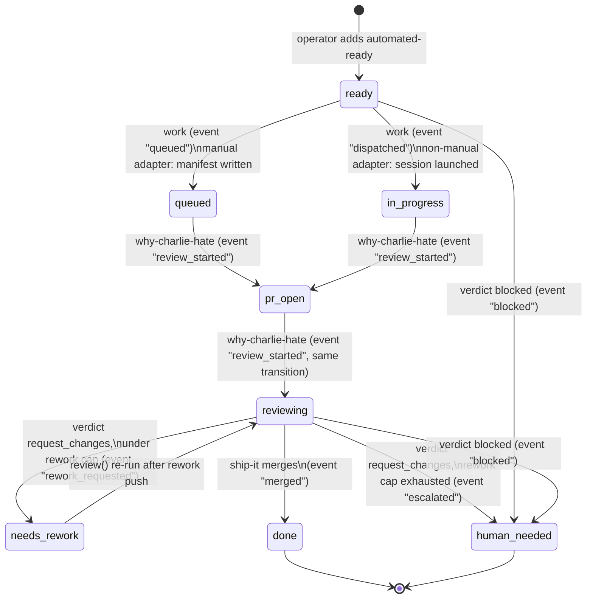

# Architecture

## Hub-and-spoke model

`charlie` is a **deterministic Python hub**. It has no chat memory and no
LLM-driven control flow of its own — every decision it makes (what to
dispatch, what to merge, what to escalate) is a pure function of GitHub state
(issues, PRs, labels, checks) and the local `.var/charlie-work/` state
tree. The hub never "thinks"; it renders prompts, shells out to `gh`/worker
CLIs, and records outcomes.

The **spokes** are hermetic, one-shot worker sessions — Devin sessions or
Claude Code processes — each bound to exactly one GitHub issue for its
entire lifetime. A worker reads a generated `worker-prompt.md`, does the
work, opens a PR, and exits. It has no channel back into the hub except
through git (commits, PR) and, optionally, a sidecar JSON file the adapter
that launched it maintains. This separation is deliberate: the LLM
non-determinism is entirely contained inside spokes; the hub's job is to be
boring and auditable.

**GitHub labels are the durable state machine.** An issue's `agent:*` labels
*are* its state — not a cache of it. This means the true state survives an
orchestrator crash, a machine reboot, or a switch to a different operator's
laptop: `charlie roll-call` reconstructs everything by re-querying GitHub.
The local `state.json` is a derived event log and convenience cache (recent
runs, artifact paths, cross-family reuse), never the source of truth for
"what state is this issue in."

```
                    ┌─────────────────────────────────────────────┐
                    │            GitHub labels = state             │
                    └─────────────────────────────────────────────┘
  intake ──► dispatch ──► worker session ──► PR ──► review ──► merge-ready
  (issues        │        (Devin / Claude       (janitor gate,      │
   labeled       │         Code, one issue       review packet,     ├─ merge
   automated-    │         per session)          optional cross-    ├─ labels
   ready)        └─ writes worker-prompt.md      family pass)       └─ branch
                    + session manifest/sidecar                        delete
                                                                    (best-effort)
```

## Module map

Each module has exactly one responsibility. Files not touched by a change
should not need to be read to reason about it.

| Module | Responsibility |
|---|---|
| `__init__.py` | Package version and `CLI_NAME` (`charlie`) constant. |
| `cli.py` | `argparse` surface: parses `charlie <command>` invocations, builds `OrchestratorApp`, and prints `CommandResult` as text or `--json`. No business logic. |
| `config.py` | Frozen dataclasses (`LabelConfig`, `DispatchConfig`, `ReviewConfig`, `AutoMergeConfig`, `RuntimeConfig`, `DevinConfig`, `ClaudeCodeConfig`, `CrossFamilyConfig`, `WatchdogConfig`, `TestAdequacyConfig`, `FleetConfig`, `NotifyConfig`) plus `load_config`/`find_config_path`. Absent `orchestrator.config.yaml` → pure dataclass defaults. |
| `workflow.py` | `OrchestratorApp` — the orchestration engine: `status`, `bootstrap_labels`, `intake`, `dispatch`, `review`, `record_review`, `merge_ready`, `spec_review`, `loop`. Owns every multi-step business rule (merge-update-not-replace, rework cap, merge/label/branch-delete ordering). |
| `github.py` | `GitHub` — every `gh` CLI invocation, JSON parsing, and the `dry_run` mutating-call guard. Also `label_names()` and `linked_issue_number()` helpers used across the codebase to read label/issue-link state from raw `gh` JSON. |
| `labels.py` | **Single point of enforcement** for label transitions — `transition(gh, labels, issue_number, event)`. Every add/remove pair is a named edge (`queued`, `dispatched`, `review_started`, `rework_requested`, `escalated`, `blocked`, `merged`); workflow code names the event, never touches individual labels. |
| `adapters.py` | `dispatch_sessions()` — the Devin `manual` (write-manifest-only) and `command` (subprocess-launch) adapters, plus the session manifest/results JSON writers. Refuses `{issue_title}` interpolation in string-form (shell) commands — command injection risk, since issue titles are attacker-influenceable on any repo taking public issues. |
| `subprocess_runner.py` | `run_captured()` — the one subprocess entry point for adapters and cross-family calls. Centralizes UTF-8 + `errors="replace"` decoding and bytes-safe `TimeoutExpired` handling so Windows console encoding never crashes a caller. |
| `checks.py` | `summarize_checks()` / `CheckSummary` — classifies `gh pr checks` output against `auto_merge.required_checks` into passed/pending/failed/missing; `.ready` is true only when none are pending, failed, or missing. |
| `cross_family.py` | `run_cross_family_review()` — runs a non-Claude model (codex via the Devin CLI, by default) against a PR diff or spec file and captures its findings as **leads, not verdicts**. Never raises; a timeout/missing-binary/non-zero exit becomes a `(UNAVAILABLE)` stub report and a not-ok result rather than aborting review-packet generation. |
| `prompts.py` | `render_prompt()` / `resolve_template()` — `string.Template.safe_substitute` rendering of `.md` templates under `prompts/`, with repo-local `runtime.prompts_dir` overriding package defaults by filename. |
| `paths.py` | `find_repo_root()` (via `git rev-parse --show-toplevel`, with a `.git`-walk fallback) and `runtime_paths()` — derives the `RuntimePaths` tree (`issues/`, `prs/`, `dispatches/`, `logs/`, `state.json`) under `runtime.state_dir`. |
| `state.py` | `load_state()` / `save_state()` / `append_event()` — the `state.json` reader/writer. Atomic writes (temp-file + `Path.replace`). A corrupt/truncated file is quarantined to `state.json.corrupt-<timestamp>`, never crashed on and never silently discarded. `append_event()` dual-writes to `events.db` (SQLite) when `state_path` is provided. |
| `instrumentation.py` | SQLite-backed append-only event log (`events.db`) with correlation ID support. `log_event()` (best-effort, never raises), `record_loop_pass()` (loop pass summary table), `correlation_context()` (thread-local ID per orchestration pass), `read_event_log()` / `events_by_correlation_id()` / `query_events()` / `event_counts_by_kind()` (retrieval and aggregation). WAL mode, indexed on kind/ts/correlation_id/pr_number/issue_number. Auto-migrates legacy `events.jsonl`. |
| `doctor.py` | `run_doctor()` — preflight diagnostics: `gh` on PATH + authenticated, config file presence, `required_checks` configured and matched against live `.github/workflows/*.yml` job names, GitHub labels exist, state file loads, dispatch adapter configured, cross-family binary on PATH (if enabled), worker template resolves. |
| `worktree.py` | Junction-safe git worktree lifecycle: `create_worktree()` (creates a worktree + optional `.venv` Windows-junction/symlink to a shared virtualenv) and `remove_worktree()` (unlinks the `.venv` reparse point *before* `git worktree remove`, so teardown never follows the junction into the shared venv and deletes its contents). See [Invariants](#invariants) below. |
| `devin_shell.py` | Non-blocking headless Devin CLI dispatch: `launch_devin_session()` spawns `devin --prompt-file <path> --print` via `Popen` (never blocks on completion) and writes a durable sidecar JSON (`sessions_dir/issue-<n>.json`) atomically before returning. `read_session_records()`, `is_session_alive()` (Windows liveness via ctypes `OpenProcess`+`GetExitCodeProcess`, since `os.kill(pid, 0)` is unreliable on Windows; `os.kill` on POSIX), and `probe_devin()` (for `doctor --adapter-probe`) round out the module. Selected by `devin.adapter: devin-shell`. |
| `claude_code.py` | Worktree-isolated Claude Code workers: `launch_claude_worker()` composes `worktree.create_worktree()` with a headless `claude -p` `Popen` launch, writing a `.claude.json` sidecar per issue (field names mirror `devin_shell`'s sidecar so downstream code can treat both worker kinds uniformly). Best-effort worktree cleanup on a failed launch. `read_worker_records()` and `probe_claude()` mirror the `devin_shell` helpers. Selected by `devin.adapter: claude-code`. |
| `janitor.py` | Deterministic, non-LLM pre-review gate: `run_janitor(pr, checks, config)` returns a `JanitorVerdict` (pass/fail + warnings) by checking draft state, PR/mergeable state, required-checks status, linked-issue presence, non-empty body with a tests/rationale mention, conventional-commit-shaped title (warning only), and oversized-diff size (warning only). Pure function — no I/O, no `gh` calls; the caller feeds it data it already fetched. `review()` calls it **before** any packet or cross-family spend and short-circuits a failing PR to `janitor_blocked`. |
| `reconcile.py` | Drift detection between GitHub's actual state and the orchestrator's recorded state — e.g. a PR merged outside `merge_ready()` whose issue is still labeled `agent:in-progress`. `detect_drift()` is read-only (two `gh` list calls, zero mutations); `apply_fixes()` returns a *new* state and repairs labels via `labels.transition`. Surfaced as `charlie mop-up [--fix]` (read-only without `--fix`). |
| `prompt_sections.py` | Shared worker-prompt partials: `section_variables(search_dirs)` discovers every `*.md` file under a `worker_sections/` directory (package default `prompts/worker_sections/`, e.g. `scope_contract.md`, `issue_metadata.md`) and exposes each as a `section_<stem>` template value — repo-local `<search_dir>/worker_sections/` wins over the package default per filename, mirroring `prompts.resolve_template`. No section names are hardcoded; the available set is whatever `*.md` files exist on disk. `render_prompt()` folds these in and runs a two-pass substitution so section text carrying its own `$placeholders` resolves. |
| `worker.py` | Adapter-agnostic worker abstraction: `WorkerView` (frozen dataclass) provides a unified shape for worker records across all adapters (devin-shell, claude-code). `iter_workers()` reads every devin-shell + claude-code sidecar in sessions_dir and returns a unified, adapter-tagged list. `update_worker_log_stat()` refreshes last_activity_at and log_bytes fields from a fresh stat() of the log file. This collapses duplicated adapter-iteration loops in workflow.py into a single abstraction point for fleet supervision. |
| `fleet_paths.py` | Platform-specific fleet directory resolution: `fleet_dir()` returns the user-level fleet directory (`%LOCALAPPDATA%\charlie-work\` on Windows, `${XDG_STATE_HOME:-~/.local/state}/charlie-work/` on POSIX). Supports override via `CHARLIE_WORK_FLEET_DIR` env var or explicit parameter for test isolation. |
| `fleet_registry.py` | Fleet registry management: `touch_repo()` registers or updates a repo in fleet.json (resolves nameWithOwner via gh repo view, stores repo_root, config_path, state_dir, first_seen/last_seen). `count_fleet_live_sessions()` counts live worker sessions across all registered repos using the adapter-agnostic `iter_workers()` from worker.py. Tolerates vanished/moved repo dirs by skipping them and returning a list of skipped repo keys. |
| `global_config.py` | Layered config loading: `load_layered_config()` loads config with a global fleet layer and per-repo override. Global config (if present) at `<fleet_dir>/config.yaml` supplies fleet-wide defaults; the per-repo orchestrator.config.yaml wins on any key present in both. Merge happens at the raw YAML dict level before validation, so unknown keys in the global file raise ConfigError exactly like unknown keys in the per-repo file. |
| `fleet_dispatch.py` | `fleet_loop()` — composes N per-repo passes across the registry under one global budget. Selects/orders repos (explicit `--repos` or oldest-`last_seen`-first), runs each repo's `dispatch()` (`work_only`) or `loop()` (bash-rats), isolates per-repo failures so one broken repo never aborts the sweep, and emits a consolidated attention digest (`notify.emit_digest`). Backs `charlie fleet work` / `fleet bash-rats`. |
| `notify.py` | Pluggable needs-attention notification layer: `classify_worker_health()`-fed `AttentionDigest`/`AttentionEntry` value objects and `emit_digest()` fan-out to one of four sinks (webhook, desktop toast, shell command, file) selected by `NotifyConfig.sink`. Sink failures come back as values and never fail the pass. Disabled by default (`notify.enabled: false`). |
| `worker.py` (health) | Beyond the `WorkerView` abstraction, owns the supervisor's `WorkerHealth` enum, `UsageSnapshot`, and `classify_worker_health()` — the multi-signal (liveness, log staleness, terminal markers, wall-clock, loop, cost/token) classifier the per-repo supervisor sweep and `status()`'s `workers` section both consume. |
| `env_sanitize.py` | `sanitize_env(target_path)` — single implementation of worker-subprocess environment sanitization; drops `VIRTUAL_ENV`/`UV_PROJECT_ENVIRONMENT` (or repoints `VIRTUAL_ENV` at the target's `.venv`) so the orchestrator's env never leaks into a worker. Shared by `claude_code`, `devin_shell`, and `cross_family`. |
| `process_utils.py` | Shared cross-adapter process helpers — `/proc/<pid>/stat` starttime parsing (PID-reuse-safe liveness), process-age computation, and related primitives used by the liveness/orphan-reaping paths. |

## Label state machine

Defined in `labels.py`'s `_edges()`, keyed off `LabelConfig` (defaults shown;
all overridable in `orchestrator.config.yaml`'s `labels:` block).



Notes tying the diagram to `_edges()` exactly:

- **`queued`**: adds `labels.queued`, removes nothing. The manual Devin
  adapter's dispatch result — a manifest was written, no worker independently
  confirmed yet.
- **`dispatched`**: adds `labels.in_progress`, removes `labels.queued`. Only
  an adapter that actually launched something (not `manual`) promotes
  straight here.
- **`review_started`**: adds `labels.pr_open` and `labels.reviewing`,
  removes nothing. Fired every time `review()` runs, including on repeated
  passes over the same PR — idempotent by construction (`gh` label-add is a
  no-op if already present).
- **`rework_requested`**: adds `labels.needs_rework`, removes
  `labels.reviewing`. Fired by `record_review(..., decision="request_changes")`
  when the prior `request_changes` cycle count is under
  `review.max_rework_cycles`.
- **`escalated`**: adds `labels.human_needed`, removes `labels.reviewing`.
  Fired when the rework cap is exhausted (see
  [Rework cap escalation](#rework-cap-escalation) below).
- **`blocked`**: adds `labels.human_needed`, removes nothing. Fired by
  `record_review(..., decision="blocked")`.
- **`merged`**: adds `labels.done`, removes every label in `labels.active`
  (`queued`, `in_progress`, `pr_open`, `reviewing`, `needs_rework` — sorted
  for deterministic `gh` call ordering). Fired by `merge_ready()` only after
  an actual merge succeeded.

`LabelConfig.terminal` = `{blocked, done, human_needed}`;
`LabelConfig.active` = `{queued, in_progress, pr_open, reviewing,
needs_rework}`. `OrchestratorApp._is_dispatchable()` requires the `ready`
label, no terminal label, and no active label — an issue already mid-flight
or already resolved is never re-dispatched.

## `state.json` schema

Located at `<state_dir>/state.json` (`state_dir` defaults to
`.var/charlie-work`, configurable via `runtime.state_dir`). Written by
`state.save_state()`: atomic (temp file + `Path.replace`), pretty-printed,
sorted keys. Schema version pinned by `state.STATE_VERSION = 1`.

```jsonc
{
  "version": 1,
  "generated_at": "2026-07-02T18:04:11Z",   // refreshed on every save
  "issues": {
    "<issue_number>": {
      "number": 565,
      "title": "...",
      "url": "https://github.com/...",
      "labels": ["agent:in-progress", "automated-ready"],
      "prompt_path": ".var/charlie-work/issues/issue-565/worker-prompt.md",
      "branch_name": "agent/issue-565-short-title",
      "status": "manifest_written",       // or "dispatched" | "dispatch_failed"
      "dispatched_at": "2026-07-02T18:00:00Z",
      "updated_at": "..."                  // from gh issue updatedAt, when set by intake()
    }
  },
  "prs": {
    "<pr_number>": {
      "number": 123,
      "url": "https://github.com/.../pull/123",
      "issue_number": 565,
      "prompt_path": ".var/charlie-work/prs/pr-123/review-prompt.md",
      "decision_path": ".var/charlie-work/prs/pr-123/review-decision.json",
      "status": "reviewing",
      "cross_family_report": ".var/charlie-work/prs/pr-123/cross-family-review.md",
      "cross_family_ok": true,
      "decision": "approved",              // set by record_review()
      // merge_ready() also folds in: can_merge, auto_merge_enabled, merged,
      // merge_output, branch_deleted, review_decision, checks
    }
  },
  "events": [
    {"at": "2026-07-02T18:00:00Z", "kind": "intake", "payload": {"issue_count": 3}},
    {"at": "2026-07-02T18:01:00Z", "kind": "dispatch", "payload": {"issue_numbers": [565], "failed_issue_numbers": []}},
    {"at": "2026-07-02T18:05:00Z", "kind": "review_packet", "payload": {"pr_number": 123, "issue_number": 565, "cross_family_ok": true, "cross_family_reused": false}},
    {"at": "2026-07-02T18:10:00Z", "kind": "record_review", "payload": {"pr_number": 123, "decision": "approved"}},
    {"at": "2026-07-02T18:11:00Z", "kind": "merge_ready", "payload": {"pr_number": 123, "can_merge": true, "merged": true}}
    // capped at the most recent 200 entries (append_event trims older ones)
  ]
}
```

`events` is append-only up to a 200-entry cap and is the closest thing to an
audit trail; `issues`/`prs` are best-effort mutable projections that
**merge-update, never dict-replace** (see [Invariants](#invariants)). A
missing or corrupt `state.json` never crashes the orchestrator: `load_state`
quarantines an unparseable file to `state.json.corrupt-<UTC-timestamp>`
(colons stripped) next to it and returns a fresh `empty_state()`.

#### Append-only `events.db` SQLite audit log

In addition to the capped `events` array in `state.json`, every event is
dual-written to an **unlimited append-only** SQLite database (`events.db`)
that lives next to `state.json`. This database is the primary audit trail
for root-cause analysis — it never trims or loses entries the way the
200-entry `state.json` buffer can.

The `events` table has the following schema:

| Column | Type | Description |
|--------|------|-------------|
| `id` | INTEGER | Auto-increment primary key |
| `ts` | TEXT | ISO-8601 UTC timestamp (indexed) |
| `kind` | TEXT | Event kind, same as `state.json` event kinds (indexed) |
| `payload` | TEXT | Full event payload as JSON blob |
| `repo` | TEXT | Repository name (when available) |
| `correlation_id` | TEXT | Thread-local ID linking events from a single orchestration pass (indexed) |
| `pr_number` | INTEGER | Extracted from payload for indexed querying |
| `issue_number` | INTEGER | Extracted from payload for indexed querying |
| `level` | TEXT | Auto-classified: `info`, `warning`, or `error` based on event kind |

A `loop_passes` summary table records per-pass metadata (start/completion
timestamps, ok status, elapsed time, error/merge/review counts).

**Correlation IDs** (`instrumentation.py`) are thread-local UUIDs set at the
start of each `loop()` pass via `correlation_context()`. All events emitted
during that pass — intake, dispatch, review, merge, errors — share the same
correlation ID, making it trivial to reconstruct the full sequence of
operations for any given pass.

The `instrumentation.py` module provides:
- `log_event()` — best-effort insert into `events.db` (never raises)
- `record_loop_pass()` — insert/update loop pass summary in `loop_passes` table
- `correlation_context()` — context manager that sets/restores a correlation ID
- `read_event_log()` — read events back, with optional `limit`
- `events_by_correlation_id()` — retrieve all events from a specific pass
- `query_events()` — structured query with filters on kind, correlation_id, pr_number, issue_number, repo, level, since/until, limit
- `event_counts_by_kind()` — aggregation summary for quick dashboards

The database uses **WAL mode** for concurrent reads during writes, with
`PRAGMA synchronous=NORMAL` and `busy_timeout=5000` for reliability under
concurrent access. Legacy `events.jsonl` files are automatically migrated
into the SQLite database on first access.

**Structured logging** is configured in `cli.py` `main()` with a `--verbose`
flag for debug-level output. The `labels.py` `transition()` function logs
every label state change at INFO level with issue number, event name, and
outcome (applied/partial_failure/nothing_changed).

The per-issue/PR artifact tree alongside `state.json`:

```
.var/charlie-work/
├── state.json
├── issues/issue-<n>/
│   ├── issue.json              # gh issue view snapshot (intake)
│   └── worker-prompt.md        # rendered from dispatch.worker_template
├── prs/pr-<n>/
│   ├── pr.json                 # gh pr view snapshot (review)
│   ├── checks.json             # gh pr checks snapshot
│   ├── diff.patch              # gh pr diff
│   ├── review-prompt.md        # rendered from prompts/review.md
│   ├── review-decision.json    # the merge-gate authority (see below)
│   ├── rework-prompt.md        # rendered on request_changes, under cap
│   ├── review-comment.md       # written when verdict --comment
│   └── cross-family-review.md  # if cross_family enabled and PR non-draft
├── cross-family/                # why-charlie-hate-spec artifacts (prompt + report per slug)
├── dispatches/
│   ├── session-manifest.json   # dispatch_sessions() write, every wave
│   └── session-results.json    # per-request ok/error outcome
└── logs/
```

`review-decision.json` is not merely a cache — `merge_ready()` reads it
directly off disk (`_review_decision`) as the authority on whether a PR is
`approved`, so it is not safely regenerable from `state.json` alone.

## Review pipeline order

```
janitor gate (deterministic, no LLM cost)
        │  fails → skip packet generation, report failures (route to rework/dispatch_failed)
        ▼  passes
review packet generation (review())
   - snapshot pr.json / checks.json / diff.patch
   - optional cross-family pass (non-draft PR, cross_family.enabled or --cross-family)
   - render review-prompt.md
   - transition("review_started") → agent:pr-open + agent:reviewing
        │
        ▼
verdict (human or orchestrating agent decides)
   - approved            → merge_ready() eligible
   - request_changes     → rework cap check → rework_requested | escalated
   - blocked             → escalated (agent:human-needed)
        │
        ▼
ship-it
   - checks.summarize_checks() against auto_merge.required_checks
   - decision.decision == "approved" (or require_approved_review: false)
   - → merge via gh pr merge (with auto_merge.merge_flags or legacy admin flag for protected bases), then labels, then best-effort branch delete
```

`janitor.py` sits **before** `review()`'s packet generation as a
deterministic gate — a pure function over `pr`/`checks` data the caller
already fetched, so it costs no extra `gh` calls and no LLM tokens. A failing
verdict short-circuits `review()` to a `janitor_blocked` result with zero
packet or cross-family spend. The `cross_family` pass, when enabled, augments the review packet
with a non-Claude model's findings but never gates by itself — its findings
are leads the reviewer must verify, exactly as `cross_family.py`'s own
`_CAVEAT` text states.

## Invariants

These are enforced once, in `workflow.py`, at the seams where production
incidents actually happened — not scattered as defensive checks:

- **Merge → labels → best-effort branch delete, in that exact order.**
  `merge_ready()` calls `gh.merge_pr()`, then `transition(..., "merged")`,
  then (if `auto_merge.delete_branch`) `gh.delete_branch()` — and the branch
  delete is wrapped so its failure (e.g. the head branch checked out in a
  local worktree) can never leave a merged PR's issue labels stale. This is
  the decoupled sequence that replaced a single `gh pr merge --delete-branch`
  call, which used to abort the label update on a worktree-checkout failure.
  `GitHub.delete_branch()` targets the **remote** ref only (via the git-refs
  API), so it never touches local worktree checkouts in the first place.
- **State merge-updates, never dict-replace.** `intake()` and `review()`
  both write `state["issues"][n]` / `state["prs"][n]` as
  `{**state[...].get(n, {}), <new fields>}` — a wholesale replace here
  previously erased `record_review`'s recorded `decision` on the next
  `review()`/`loop()` pass (confirmed in production, PR #497).
- **Rework cap escalation.** `record_review()` counts prior
  `record_review` events for that PR number with `decision ==
  "request_changes"` directly from `state["events"]` (no separate counter
  field). At or past `review.max_rework_cycles` (default `2`; both shipped
  example configs raise it to `3`), the next `request_changes` decision fires
  `"escalated"` instead of `"rework_requested"` — `agent:human-needed`
  instead of another rework prompt. This exists because iteration past ~2-3
  rounds empirically thrashes (wrong brief or genuinely unimplementable
  criteria) rather than converging.
- **Cross-family stub reuse only on success.** `_cross_family_for_pr` reuses
  an existing `cross-family-review.md` only if its first line does **not**
  contain `(UNAVAILABLE)` — a failed run's stub must not be treated as a
  permanent success on the next pass.
- **Per-PR isolation in `loop()`.** Each PR's `review()`/`merge_ready()` call
  is wrapped in its own `try/except GitHubError`; one PR's merge conflict or
  `gh` failure is recorded in `errors` and does not abort the rest of the
  batch.
- **`.venv` junction-before-worktree-removal (worktree.py, landing in this
  release).** `remove_worktree()` unlinks a `.venv` reparse point
  (`os.rmdir` on the junction itself) *before* calling `git worktree
  remove`. Naive teardown (`git worktree remove --force` / `rm -rf`) follows
  a `.venv` junction into the one shared virtualenv all worktrees link to
  and deletes its contents, corrupting every other live worktree. See
  [RUNBOOK.md](RUNBOOK.md) for the operational recovery procedure if this
  invariant is ever bypassed manually.

## Adapter boundary

`devin.adapter` selects how a worker session actually gets launched:

- `manual` — write a session manifest, operator pastes the prompt into a Devin
  app session by hand. No subprocess; `ok=True` means "manifest written", not
  "worker launched", so the issue is labelled `agent:queued` (not
  `agent:in-progress`).
- `command` — subprocess-launch via `devin.dispatch_command`, blocking,
  through `run_captured`.
- `devin-shell` — headless `devin --print` via `Popen` (non-blocking),
  sidecar-JSON-tracked (`devin_shell.py`).
- `claude-code` — headless `claude -p` in an isolated git worktree
  (`claude_code.py`), sidecar-JSON-tracked, junction-safe shared venv.

All four are routed by `adapters.dispatch_sessions` from a single
`AdapterSettings` the workflow resolves. Only adapters that actually launch a
worker (`command`/`devin-shell`/`claude-code`) promote the issue to
`agent:in-progress`; a launched worker is recorded in `state.json` **before**

## Supervisor and fleet reconciliation

The fleet-management design adds two architectural layers for multi-repo
coordination and worker health supervision. Neither is a daemon — both are
invoke-per-pass, matching the hub-and-spoke model.

**Per-repo supervisor sweep**: The supervisor layer (per-worker health
classification, tripwires, and restart-intensity escalation) runs as a sweep
nested inside the existing intake→dispatch→review→merge pass. It classifies
worker health using the adapter-agnostic `WorkerView` abstraction from
`worker.py`, applies tripwires (liveness, staleness, terminal-marker,
wall-clock, cost, loop, orphan), and escalates to `agent:human-needed` when
the restart-intensity cap is exceeded. This generalizes the shipped
stalled-session watchdog (#109/#136) that already runs unconditionally inside
`dispatch()`'s real-dispatch branch.

**Fleet layer composition**: The fleet layer composes N per-repo passes under one
global budget via `fleet.global_max_concurrent_sessions`. The registry
(`fleet_registry.py`) tracks registered repos by `nameWithOwner`, and the
global config layer (`global_config.py`) merges fleet-wide defaults with
per-repo overrides. The governor `_apply_concurrency_governor()` in
`workflow.py` applies both the per-repo `dispatch.max_concurrent_sessions` cap
and the fleet-global cap at every dispatch path. Fleet-level commands
(`charlie fleet status`) aggregate status across all registered repos by
iterating over the registry and calling `OrchestratorApp.status()` per repo
with `dry_run=True`.

**Two-reconciler-at-two-scopes**: The architecture maintains two reconcilers at
two scopes — the per-repo supervisor sweep (nested inside each repo's pass) and
the fleet layer (composing N per-repo passes under one global budget). Neither
is a daemon; both are invoke-per-pass, and detection latency equals invocation
cadence.
